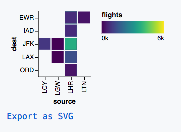
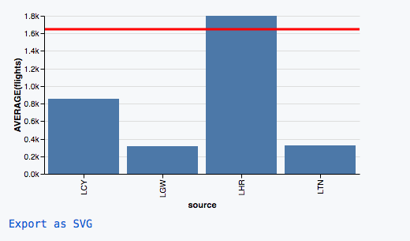
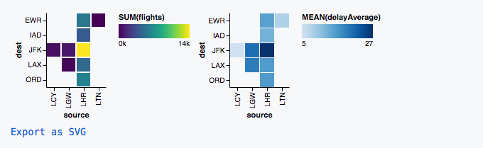
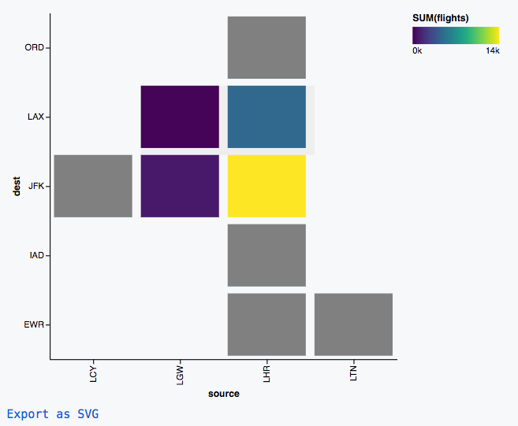

# [fit] Interactive Data Visualisation
# _Using Visdown at [http://visdown.com](http://visdown.com)_

<br>

_Amit Kapoor_
[amitkaps.com](http://amitkaps.com)

_Bargava Subramanian_
[@bargava](https://twitter.com/bargava)

---

> “The purpose of visualisation is insight, not pictures.”
-- Ben Shniederman

---

# **Creating Visualisation**
- Single View
- Multi-View
    - Faceting
    - Layering
    - Composition
- Interaction

---

# Dataset

- Observations `(n)` : 157
- Features `(p)`     : 7
- Source: It is adapted from flight punctuality statistics from the London Civil Aviation Authority

# [http://visdown.com/london](http://visdown.com/london)

---

# Variables

- `source`  : The source IATA airport code 
- `dest` : The destination IATA airport code
- `airline` : The two letter IATA code for the airline 
- `flights` : The number of flights in that year
- `onTimePerf` : The precentage of flights on-time in that route
- `delayAverage` : The average delay in minutes for that route and airline
- `year`: The year of data

---

# Flights Dataset

source | dest   |  airline | flights| onTimePerf| delayAverage | year |
:------|:-------|:---------|-------:|----------:|-------------:|-----:|
LHR    |  ORD   |  AA      |   2490 |     63.33 |       21.11  | 2010 |
LHR    |  ORD   |  BA      |   1413 |     57.36 |       23.30  | 2010 |
LHR    |  ORD   |  UA      |   2105 |     73.24 |       14.57  | 2010 |
LHR    |  ORD   |  VS      |    218 |     77.06 |       11.10  | 2010 |
...    | ...    |    ...   |  ...   |     ...   |        ...   |  ... |
LHR    |  IAD   |  US      |   2134 |     82.05 |       13.24  | 2016 |
LHR    |  IAD   |  VS      |    699 |     84.69 |        8.02  | 2016 |
LCY    |  JFK   |  BA      |    921 |     90.01 |        5.26  | 2016 |
LTN    |  EWR   |  DJT     |    333 |     87.05 |        8.44  | 2016 |


---

# Single View

_What is total number of flights by Source & Destination in 2016?_



---


# Single View

```yaml
data:
  url: "data/london.csv"
transform:
 -
   filter: datum.year == 2016
mark: rect
encoding:
  x:
    type: nominal
    field: source
  y:
    type: nominal
    field: dest
  color:
    type: quantitative
    field: flights
    aggregate: sum
```

---

# Multi View - Facet

_What is total number of flights by Source & Destination for each year?_


---


# Multi View - Facet

```yaml
data:
  url: "data/london.csv"
mark: rect
encoding:
  x:
    type: nominal
    field: source
  y:
    type: nominal
    field: dest
  color:
    type: quantitative
    field: flights
    aggregate: sum
  column:
    field: year
    type: nominal
```

---

> “A picture is worth a thousand words. An interface is worth a thousand pictures.”
-- Ben Shneiderman

---

# Multi View - Layering

_What is total number of flights and average of number flights leaving London?_



---


# Multi View - Layering

```yaml
width: 400
data:
    url: "data/london.csv"
layer:
 -
  mark: rect
  encoding:
    x:
     type: nominal
     field: source
    y:
     type: quantitative
     field: flights
     aggregate: average
 -
  mark: rule
  encoding:
    y:
     type: quantitative
     field: flights
     aggregate: average
    color:
      value: red
    size:
      value: 3
```

---

# Multi View - Composition

_What is total number of flights and average delay by Source & Destination for each year?_



---


# Composition

```
hconcat:
  - 
    <first chart spec>
  - 
    <second chart spec>
```

---

```yaml
hconcat:
 -
  data:
    url: "data/london.csv"
  transform:
   -
    filter: datum.year == 2016
  mark: rect
  encoding:
    x:
     type: nominal
     field: source
    y:
     type: nominal
     field: dest
    color:
     type: quantitative
     field: flights
     aggregate: sum
 -
  data:
    url: "data/london.csv"
  transform:
   -
    filter: datum.year == 2016
  mark: bar
  encoding:
    x:
     type: nominal
     field: source
    y:
     type: nominal
     field: dest
    color:
     type: quantitative
     field: delayAverage
     aggregate: mean
```

---


# Interaction: Brushing

_Select a particular Source & Destination in the visualisation for number of flights in 2016?_



---


# Interaction: Brushing

```yaml

width: 400
height: 400
data:
  url: "data/london.csv"
transform:
  - 
   filter: datum.year == 2016
selection:
  brush:
   type: interval
mark: rect
encoding:
  x:
    type: nominal
    field: source
  y:
    type: nominal
    field: dest
  color:
    type: quantitative
    field: flights
    aggregate: sum
    condition: 
      selection: "!brush"
      value: grey
```

---

# [fit] Interactive Data Visualisation
# _Using Visdown at [http://visdown.com](http://visdown.com)_

<br>

_Amit Kapoor_
[amitkaps.com](http://amitkaps.com)

_Bargava Subramanian_
[@bargava](https://twitter.com/bargava)

